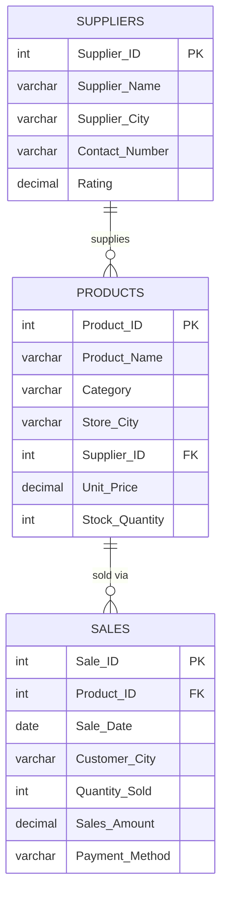

# Retail Store Inventory & Sales — SQL Practice Project

A self-contained SQL project covering database design, data population, and querying for a fictional multi-city UK retail store. The project uses three related tables — **Products**, **Suppliers**, and **Sales** — and works through 60 progressively more advanced tasks, from `CREATE TABLE` statements through aggregation, filtering, and business-analysis queries.

## Overview

| | |
|---|---|
| **Database** | Retail Store Inventory & Sales (3 tables, relational) |
| **Tasks completed** | 60 |
| **SQL concepts covered** | DDL, DML, filtering, sorting, `NULL` handling, aggregation, `GROUP BY` / `HAVING` |
| **Tools used** | Standard SQL (MySQL-compatible syntax) |

## Repository Structure

```
├── SQL_Assignment_Retail_Store.sql   # Full annotated SQL script (all 60 tasks)
├── data/
│   ├── Products.csv                  # 50 product records
│   ├── Suppliers.csv                 # 50 supplier records
│   └── Sales.csv                     # 50 sales transaction records
└── README.md
```

The `.sql` file is fully self-contained: running it from top to bottom creates all three tables and populates them, so no separate database setup is required. The CSVs in `data/` are the same source records supplied in tabular form, useful for quickly loading the data into a spreadsheet, pandas, or a BI tool.

## Database Schema



`Products.Supplier_ID` and `Sales.Product_ID` are both nullable in this dataset by design — several tasks specifically test filtering for missing (`NULL`) values (e.g. products without an assigned supplier, or sales with no recorded payment method).

## Task Breakdown

The script is organised into six sections:

| Section | Focus | Tasks |
|---|---|---|
| **A — Database & Data Preparation** | `CREATE TABLE` for all three tables; populate with records | 6–11 |
| **B — Data Modification & Retrieval** | `INSERT`, `UPDATE`, `DELETE`; basic `SELECT`/`WHERE` filtering, `AND`/`OR`/`<>` | 12–25 |
| **C — Unique Values & Sorting** | `DISTINCT`, `ORDER BY` (single and multi-column) | 26–33 |
| **D — Range, List & Missing Values** | `BETWEEN`, `IN`, `IS NULL` / `IS NOT NULL` | 34–45 |
| **E — Summary & Business Analysis** | `COUNT`, `SUM`, `AVG`, `MIN`, `MAX`, `GROUP BY`, `HAVING` | 46–60 |
| **F — Final Data Files** | Products.csv, Suppliers.csv, Sales.csv exported alongside the script | — |

## Key Insights

Figures below are computed from the final state of the database after all `INSERT`/`UPDATE`/`DELETE` tasks in the script are applied (52 products, 50 suppliers, 50 sales records):

- **Total sales revenue:** £21,621.63 across 50 transactions
- **Average product unit price:** £107.52
- **Highest single sale:** £2,239.20 · **Lowest:** £34.40
- **Revenue by payment method:** Cash leads (£9,348.25), ahead of Card (£6,314.03) and Online (£5,086.19) — with £873.16 in sales recorded against a missing payment method
- **Stock by category:** Electronics holds the most stock (1,912 units), followed by Home (1,476), Office Supplies (1,422), and Personal Care (1,343)
- **Busiest customer city by units sold:** Birmingham (53 units), ahead of Sheffield and Bristol (29 each)
- **Data quality:** 5 products have no assigned supplier and 5 sales records have no recorded payment method — both deliberately included to practise `NULL`-handling queries (Tasks 40–45)

## How to Run

Any MySQL-compatible or SQLite engine will run this script as-is.

**MySQL / MariaDB**
```bash
mysql -u your_user -p your_database < SQL_Assignment_Retail_Store.sql
```

**SQLite**
```bash
sqlite3 retail_store.db < SQL_Assignment_Retail_Store.sql
```

**Python (no local install needed)**
```python
import sqlite3
conn = sqlite3.connect(":memory:")
with open("SQL_Assignment_Retail_Store.sql") as f:
    conn.executescript(f.read())
```

## Skills Demonstrated

- Relational database design across three linked tables
- Full DDL/DML lifecycle: create, insert, update, delete
- Filtering with comparison, logical, range (`BETWEEN`), and list (`IN`) operators
- `NULL`-aware querying (`IS NULL` / `IS NOT NULL`)
- Aggregation and grouped analysis with `GROUP BY` and `HAVING`
- Translating raw transactional data into business-relevant summary metrics

## Author

**Abu Hurairah**
MSc Bioinformatics (University of Liverpool) · MSc Medical Biotechnology
[LinkedIn](https://www.linkedin.com/in/pathan-abuhurairah-rahman-1997-khan) · [GitHub](https://github.com/Abu1997-Pathan)
